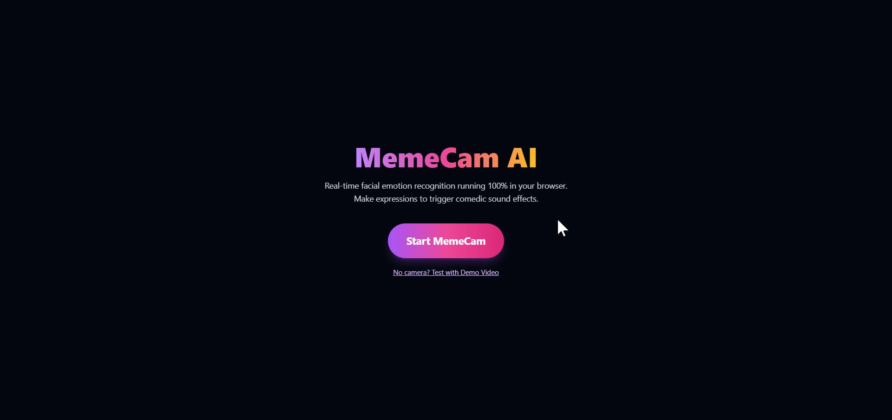
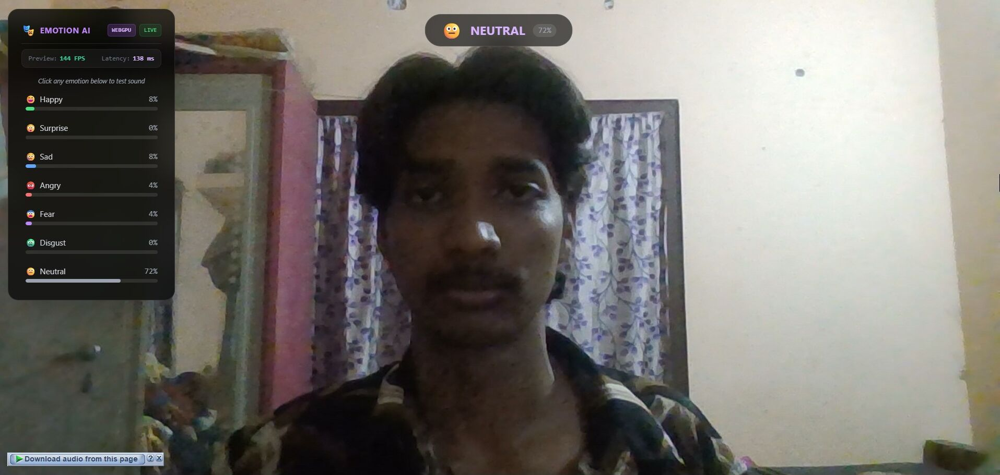
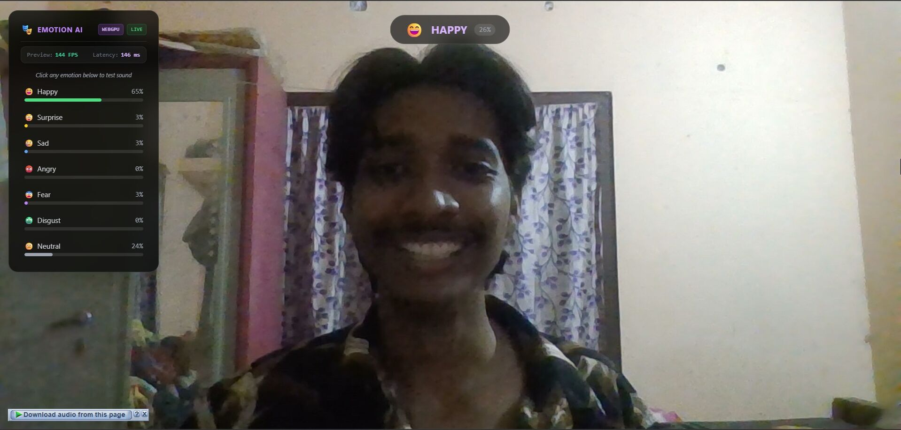

# MemeCam AI 🎯

## Basic Details
### Team Name: GPU Not Found:404 error

### Team Members
* Team Lead: Mohammad Riswan - College Of Engineering And Management Punnapra
* Member 2:  Arun Anil Mathew- College Of Engineering And Management Punnapra

### Project Description
MemeCam AI is a zero-backend, browser-based AR soundboard. It analyzes your facial expressions in real-time using Hugging Face AI models and automatically triggers iconic Malayalam comedy audio effects when you smile, act shocked, frown, or get angry!

### The Problem (that doesn't exist)
Real-life conversations and video calls are far too boring. People watch memes, but they can't *become* the memes in real-time. There is a desperate, unspoken need for Jagathy's shock sounds or Salim Kumar's laugh to play automatically the exact millisecond you react to something.

### The Solution (that nobody asked for)
An AI-powered webcam that constantly judges your facial expressions and blasts loud Malayalam comedy sound effects based on your emotions. It runs 100% locally in your browser, using AI to instantly trigger the perfect meme sound whenever your expression changes.

## Technical Details
### Technologies/Components Used
For Software:
* **Languages used**: TypeScript, HTML, CSS
* **Frameworks used**: Vite
* **Libraries used**: `@huggingface/transformers` (for in-browser AI), TailwindCSS
* **Tools used**: ONNX Runtime Web (WebGPU/WASM), Supabase (for hosting public sound clips)

For Hardware:
* A working Webcam / Laptop Camera

### Implementation
For Software:
# Installation
```bash
npm install
```

# Run
```bash
npm run dev
```

### Project Documentation
For Software:

# Screenshots (Add at least 3)



*opening screen .*


*MemeCam identifying a neutral expression.*


*MemeCam identifying a happy expression and playing its sound.*

# Diagrams

*Workflow: Webcam -> Canvas Crop -> Hugging Face Transformer Model (Web Worker) -> Emotion Scoring -> Audio Engine Trigger.*

For Hardware:

# Schematic & Circuit
N/A - Pure Software Project

# Build Photos
N/A

### Project Demo
# Video
[Add your demo video link here]
*This video demonstrates how the AI instantly picks up on facial changes and triggers the appropriate Malayalam meme audio without any lag.*

# Additional Demos
[Add any extra demo materials/links]

## Team Contributions
* [Name 1]: [Specific contributions]
* [Name 2]: [Specific contributions]
* [Name 3]: [Specific contributions]

---
Made with ❤️ at TinkerHub Useless Projects 


